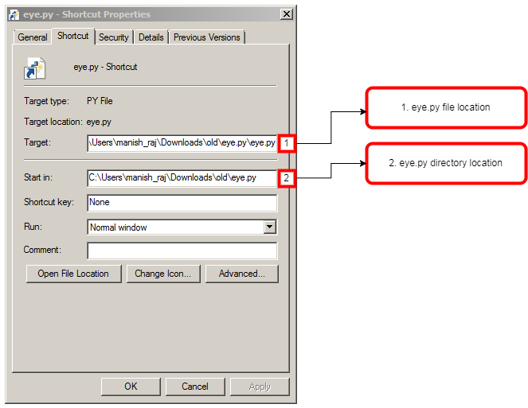

# eye.py

For windows machines.

Reminds you to look away from your computer, every once in a while. 

## Instructions:



Clone the repo: 

```git clone https://github.com/androidfanatic/eye.py --depth 1```

Right click on shortcut link and update the location of your eye.py file

Then drop the shortcut in startup folder: C:\ProgramData\Microsoft\Windows\Start Menu\Programs\Startup
